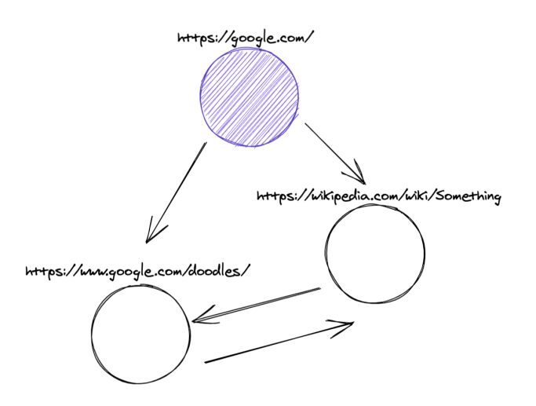
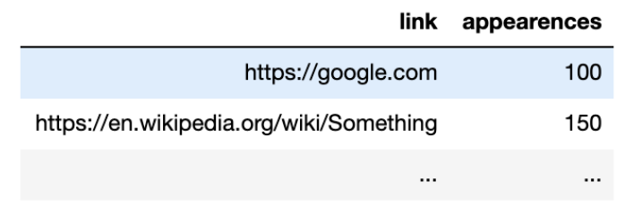
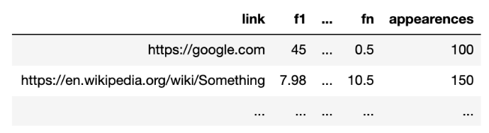

# TECHNICAL CHALLENGE

## The Challenge

We want to build a reference map on a website and understand which will be the most viewed by users when browsing.

For this we will make a crawler to help us get this information. Then, with the data obtained, we will train a model against historical data.

A crawler is a tool that allows us to enter a link and obtain information about it, for example, if the link is active or not.

In the case of this exercise, this software will allow us to evaluate the HTML response, parse it and obtain the links that are referenced within it.

In addition, this crawler will re-execute this procedure for each link it finds after this process, putting together a map like the following:

  

Our challenge will be to count the number of references (“appearences”) that we find of a link from other sources.

In the example case, the link https://www.google.com/doodles/ it has 2 "appearences", while https://google.com/ has 0 "appearences" (since no other page is referencing it).

Understanding that the growth of this process is exponential (and potentially infinite), at the beginning of the process will be defined a maximum degree of depth N, which we can reach. 

That is, we will stop the process when reaching the referenced link more than N steps after the initial link.

### First Part: Generation of Features

In the first instance, the objective is to build a project that has the ability to crawl the different links from a base set and persist, for each link, **how many different references (appearences)** of external pages were found. 

The maximum level, N, of depth of the crawler is defined at the beginning of the process:

  

In addition, this information can be enriched for each link with the information that it deems necessary to store.

Once the map is finished, for each link of the base set it is required to build a vector with at least 10 numerical characteristics based on said map, using the enrichment information previously obtained.

An example of a characteristic is "the number of characters in the link." 

These characteristics should only depend on information that can be obtained from the link -to be able to dynamically load them later-.

This vector must be saved in a new storage instance (table, document, file, etc):

  

Each of these vectors must be persisted in the type of persistence that the user defines -unless it is forced by the conditions of the exercise-.

Finally, a REST API will be built such that it uses the defined storage and allows **obtaining the vector of features associated with a link**:

- If the link is in the database, answer the precalculated vector.
- If the link is not found in the database, the values corresponding to the vector must be calculated, inserted into the database and then returned. This vector will not have the number of external references calculated.

## My Achievements

I build the crawler using [Scrapy]('https://docs.scrapy.org/en/latest/index.html'), this crawler can be access in [meli_challenge/meli_challenge/spiders/extract_links.py](./meli_challenge/meli_challenge/spiders/extract_links.py)

The data transformation I build using Scrapy Item Pipelines, more details can be access in 'https://docs.scrapy.org/en/latest/topics/item-pipeline.html'.

Scrapy Item Pipeline source code can be access in [meli_challenge/pipelines.py](./meli_challenge/meli_challenge/pipelines.py).

Item Pipeline will analyse all the scrapped data and will count the appearences.

I don't built the REST API yet, but I created a Jupyter Notebook to analyse extracted links and to create Vectors.

Jupyter Notebook can be access in [vector-analytics.ipynb](./vector-analytics.ipynb).

### Run locally

To run this project locally.

**Create virtual environment**

```
virtualenv -p python3.8 venv
```

**Active Virtual Environment**

```
source venv/bin/activate
```

**Install necessary libs**

```
pip install -r requirements.txt
```

**Run Scrapy crawler**

Go to meli_challenge directory

```
cd meli_challenge/
```

Now run the crawler

```
scrapy crawl LinkCrawler -L INFO
```

The final output should be

```
{'downloader/request_bytes': 19931,
 'downloader/request_count': 73,
 'downloader/request_method_count/GET': 73,
 'downloader/response_bytes': 739930,
 'downloader/response_count': 73,
 'downloader/response_status_count/200': 51,
 'downloader/response_status_count/301': 8,
 'downloader/response_status_count/302': 12,
 'downloader/response_status_count/403': 2,
 'dupefilter/filtered': 1,
 'elapsed_time_seconds': 75.676707,
 'finish_reason': 'finished',
 'finish_time': datetime.datetime(2021, 4, 25, 5, 13, 7, 245775),
 'httpcompression/response_bytes': 6332836,
 'httpcompression/response_count': 52,
 'item_scraped_count': 50,
 'log_count/INFO': 11,
 'memusage/max': 309370880,
 'memusage/startup': 61227008,
 'request_depth_max': 2,
 'response_received_count': 53,
 'scheduler/dequeued': 73,
 'scheduler/dequeued/memory': 73,
 'scheduler/enqueued': 73,
 'scheduler/enqueued/memory': 73,
 'start_time': datetime.datetime(2021, 4, 25, 5, 11, 51, 569068)}
2021-04-25 02:13:07 [scrapy.core.engine] INFO: Spider closed (finished)
```

Check items file in [meli_challenge/items.jl](./meli_challenge/items.jl)  

**Checking Results**

Go to [Jupyter Notebook]('./vector-analytics.ipynb') to see the Results.

### TO-DO List

- Build the challenge REST API.